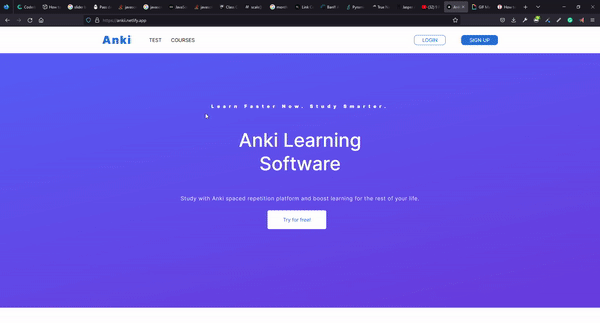
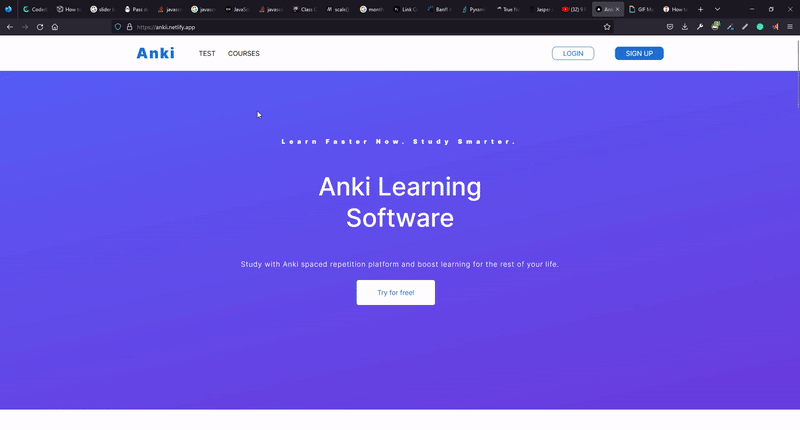

This is a React.js & Next.js project integrated with SASS. It provides a pixel-perfect responsive design and allow users to take quizzes and show's their results at the end.

Data for all the quizzes: [Quizzes](../../tree/main/src/components/question)
## How I worked on this project
* I divided the layout into several smaller user interface components.
* I worked with tasks on a Kanban board to keep the project organized.

## Available Scripts
* yarn or npm install installs all dependencies
* yarn dev or npm run dev starts the server You should be able to access the app through http://localhost:3000

# Demo 

## Landing Page

## Quiz

## How to navigate this project
* [Layout](../../tree/main/src/layouts)
* [Layout UI components with Logic](../../tree/main/src/components/UI)
* [All other UI components](../../tree/main/src/components/UI)
* [Quiz component implementation ](../../tree/main/src/components/Quiz)

## Why I built this project this way 
* I decided to create the app with Next.js because of it's routing, fast refresh, and static file serving.

